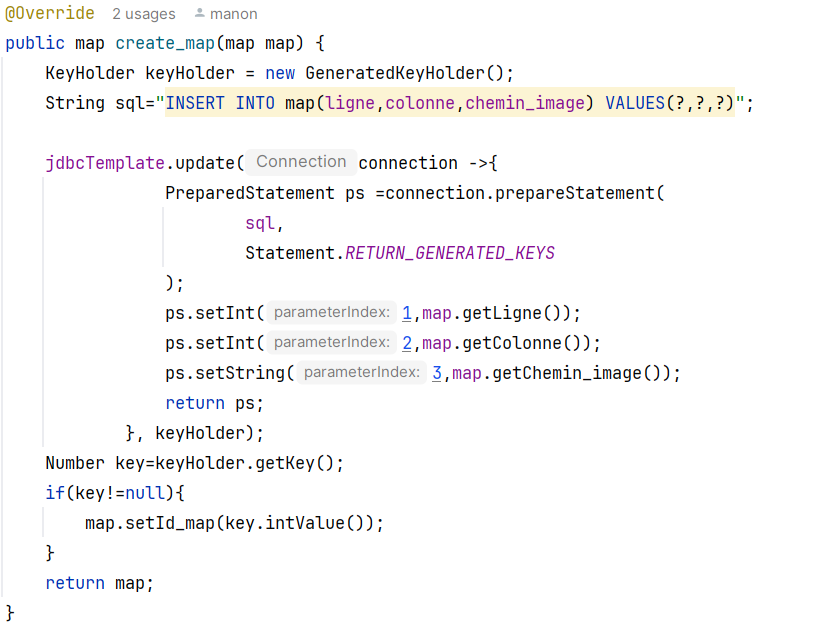
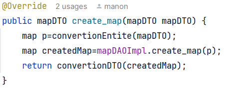
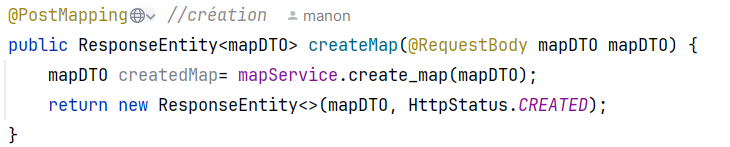

# Projet Plantes VS Zombies
BACQUE Manon - MIN 2

Ce dossier contient le Backend du jeu Plante VS Zombie. 
Le jeu a été développé par PopCap Games, et sorti en 2009.
Le but du jeu est de défendre sa maison contre une invasion de zombies. Avant de rentrer dans la maison et de manger le cerveau du joueur, les zombies doivent passer par le jardin et c'est à l'aide de toute une panoplie de plantes que le joueur pourra mettre en place sa défense contre des vagues de zombies.

Ainsi, dans ce projet, nous avons besoin de trois entités : les zombies, les plantes et les maps.
Nous avons donc créé ces trois classes avec leurs tests associés. Et pour chaque classe, nous avons créé les trois couches qui fondent le Backend d'une application : les **DAO**, les **Services** et les **contrôleurs**.

Dans ce readme, nous allons vous expliquer le rôle de chaque couche puis comment nous avons géré la connexion entre notre Backend et le Frontend fourni.

## 1. Les DAOs : 
Les **DAOs** permettent de faire le lien entre le code Java et la base de données. Elles le font grâce à des requêtes SQL.
Elles permettent de _récupérer_ (GET), _ajouter_ (Create), _modifier_ (Update) et _supprimer_ (Delete) des éléments dans la base de données et de les convertir en objet Java grâce à la méthode RowMapper().
Pour ce faire, nous avons utilisé **_jdbcTemplate_**. **_JdbcTemplate_** est une classe utilitaire de Spring qui simplifie l'exécution des requêtes SQL sans devoir gérer la connexion et la déconnexion de la base. Celle-ci est gérée dans une classe DatabseConfig qui permet la connexion avec notre base de données. 

Pour ces **DAO**, j'ai créé deux types de classes. La première, les **DAOs** où on retrouve toutes les méthodes à implémenter. Puis la classe DAOImpl qui est la classe avec les méthodes implémentées. J'ai répété trois fois le schéma pour les trois entités plante, zombie et map.

Exemple avec la méthode createMap():

Cette méthode reçoit en argument une entité map qu'elle va ensuite traduire en requête SQL INSERT pour ajouter cet élément à la table map de la base de données. Elle utilise JdbcTemplate pour exécuter la requête. Puis grâce à la méthode GeneratedKeyGolder, elle va récupérer la clé de ce nouvel élément dans la table (car il y a une auto-incrémentation dans la table). Puis, elle retourne l'élément créé avec son id correspondant.

## 2. Les Services :
Les **services** permettent de faire le lien entre les DAOs et les contrôleurs. Les DAOs qui sont les entités réelles présentes dans la BDD et les contrôleurs qui utilisent des DTOs qui sont des entités simplifiées pour l'utilisateur dans le front. 
Cette couche permet de convertir nos données reçues en DAO pour l'envoyer au DAO, et en DTO pour l'envoyer au contrôleur.
Dans cette classe, nous retrouvons les mêmes méthodes que dans la classe DAO : _récupérer_ (Get), _créer_ (Create), _modifier_ (Update) et _supprimer_ (Delete). Et nous avons ajouté deux méthodes _convertionDTO()_ pour convertir une entité en DTO et une méthode _convertionEntite()_ pour convertir un DTO en DAO.

Exemple avec la méthode createMap() :

Cette méthode reçoit en argument l'objet DTO map. Puis la méthode fait appel à la méthode conversionEntite() pour convertir le DTO en DAO. Et fait ensuite appel à la méthode createMap de la classe DAO. Pour finir, elle retourne un objet DTO.

## 3. Les Controllers :
Pour finir, les **contrôleurs** sont résponsables de récupérer les requêtes HTTP venant du front, d'appeler le service associé à la classe (zombie, map, plante) et de retourner une réponse HTTP avec la méthode ReponseEntity qui renvoie le code d'état de la requête (ex : 200 réussi). Il ne manipule que des DTOs, il reçoit des DTO et renvoie les statuts des requêtes HTTP.
Il contient comme les deux autres couches les méthodes de : _récupération_ (Get), _création_ (Create), _modification_ (Update) et _suppression_ (Delete).

Exemple avec la méthode createMap() :

Pour commencer, cette méthode reçoit une requête HTTP Post envoyée par le front avec un objet DTO envoyé sous le format JSON. Puis la méthode appelle la méthode createMap de la classe Service. Pour finir, elle retourne la réponse HTTP avec le corps de la map créée et le statut de la requête

## 4. Liaison entre le BackEnd et le FrontEnd :

Dans cette partie, nous avons utilisé **Tomcat** pour faire le lien entre nos deux dossiers celui frontEnd et celui du BackEnd.

Pour ce faire, nous avons créé un dossier **_webapp_** dans lequel il y a **_WEB-INF_**. Le dossier **_WEB-INF_** est un dossier qui contient toutes les configurations utilisées par notre serveur mais, de manière cachée.

Dans ce dossier, on retrouve **_web.xml_** et **_spring-config.xml_**.
Le fichier **_web.xml_** est le descripteur de déploiement. Il définit la configuration principale de l'application web. Il est utilisé par Tomcat au démarrage pour savoir comment configurer l'application.
Le fichier **_spring-config.xml_** est le fichier de configuration de Spring. Il configure les emplacements où chercher nos contrôleurs, les vues et, est en lien avec le fichier _web.xml_.

Nous avons également utilisé le fichier **WebConfig** qui est la configuration Spring qui définit les requêtes gérées par Spring MVC (contrôleurs et API). Il fonctionne avec le fichier **CorsFilter** qui permet de gérer les autorisations avec le frontend. Ils permettent au frontend de communiquer avec le backend.

